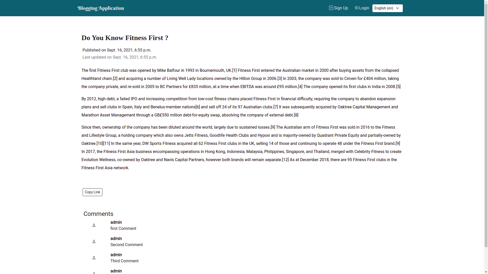

# Multilingual-Blog-Application
Blogging Web Application contains an interface where authors can create different categories [for example: Education, Science, Fitness etc]. Then the site administrator will approve the category. After that authors can create a post on that category. However, posts must be approved by the site administrator. This type of security layer will help the platform owner to reduce the spam and deliver genuine and appropriate content. The audience/ users can brower the posts which are published recently. Whereas, they also can browse the post based on different categories. On the other hand, a search bar will also be present on the main index page where the user can search for old posts based on the title.


[Project LIVE Demo Link](https://django-blogging-application.herokuapp.com/)

[High Level Design Document](https://docs.google.com/document/d/1OxUNSq9vuRio_qb9em_q0Q2j7IrXksqo-ruAYOBvb4Q/edit?usp=sharing)

[Low Level Design Document](https://docs.google.com/document/d/1GCvHbeXTsyaXOgZ1iYzNRc4rMDfo0dNDrF6WIeZqR8M/edit?usp=sharing)

[Architecture Document](https://docs.google.com/document/d/1I0SkUjd0Swrd43qxHLb8RqAqJfvO9w8UHRh1I0fpeQ0/edit?usp=sharing)

[Wireframe Document](https://docs.google.com/document/d/1M_PEpMxQaC2pRPm1kbclx1kr9dRwFiN2pBFFBdzRFHs/edit?usp=sharing)




**How to run this project in local environment**

Step 1: Clone this repository

Step 2: Install the project dependency by running this command on repository directory where requirements.txt file is present
```python
pip install -r requirements.txt
```

Step 2: Move to the project directory[Blog directory where manage.py file is located], run the migration
```python
python manage.py migrate
```

Step 3: Start the development Server
```python
python manage.py runserver
```